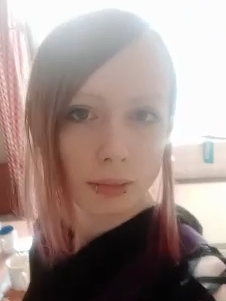

# Leyla Ladygina
## Junior frontend developer 
---
### Contacts: 
 Leyla (@Neysel)
 neyseltheblack@gmail.com 

---
## About myself
 I love working in the field of technology and development, I am purposeful and I love to develop very much. Earlier I worked as a main technical support worker in the field of aggregation of messengers in CPM and acceleration of business processes. 

## Skills 
 HTML, CSS, JS, Vue, Gulp, SQL
#### Code example https://neysel.github.io/folder/ 

## Experience
 2021 - 2022 A main technical support engineer, periodically had to understand api documentation, as well as gather people every week to discuss further developments. 
## Education 
 Course Frontend developer  HTML, CSS, JavaScript 
## English 
 I have B2 level in English, i provided conversations with brazilian business partners and presented new features to them.